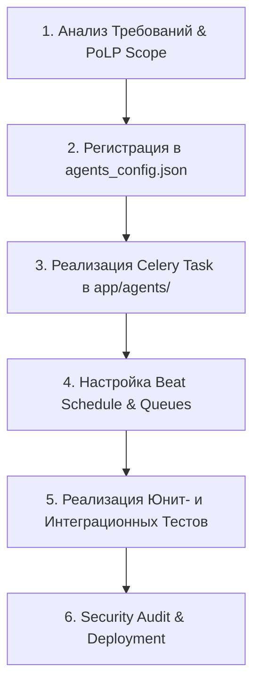

# Architecture & Onboarding Playbook — WB FBS Manager Multi-Agent System

> **Версия**: 1.0.0  
> **Статус**: Production Standard  
> **Назначение**: Руководство по архитектуре мультиагентной системы, фреймворку безопасности (PoLP), регламенту добавления новых агентов и правилам арбитража.

---

## 1. Введение и Обзор Архитектуры

Сервис **WB FBS Manager** представляет собой мультитенантную SaaS-платформу для автоматизации торговли на Wildberries по схеме FBS с обязательной маркировкой «Честный Знак» (ГИС МТ).

Мультиагентный слой построен на базе асинхронного брокера задач **Celery + Redis** и предназначен для изолированного, параллельного и отказоустойчивого выполнения специализированных бизнес-процессов.

### 1.1 Топология и Матрица Агентов

Система включает 11 специализированных агентов:

| Идентификатор | Имя Агента | Очередь Celery | Триггер / Расписание | Назначение |
|---|---|---|---|---|
| `order_poller` | Order Poller Agent | `orders` | Каждые 60 сек | Опрос новых сборочных заданий WB API, проверка КИЗ, скачивание стикеров |
| `supply_agent` | Supply & Shipment Agent | `supplies` | Событийный / Manual | Формирование поставок, добавление заказов, привязка ШК, закрытие поставок |
| `cz_withdrawal` | CZ KIZ Withdrawal Agent | `cz_operations` | Ежедневно в 03:00 / Событийный | Вывод КИЗ (SGTIN) из оборота в ГИС МТ (True API) с подписью КриптоПро УКЭП |
| `cz_return` | CZ KIZ Return Agent | `cz_operations` | Событийный | Повторный ввод КИЗ в оборот при возврате товаров от покупателя |
| `archive_processor` | Archive & Sync Agent | `archive` | Ежедневно в 03:30 | Сверка статусов выполненных заказов и архивация операций ГИС МТ |
| `notifier` | Telegram Notifier Agent | `notifications` | Событийный | Отправка push-уведомлений с inline-кнопками в Telegram менеджеру |
| `cleanup` | Data Retention Agent | `maintenance` | Еженедельно (Вс 04:00) | Очистка устаревших логов аудита и временных файлов стикеров |
| `qa_test_agent` | QA Testing Agent | `qa_testing` | Каждые 30 мин | Синтетические проверки интеграций, health-check API и изолированные автотесты |
| `cz_token_refresher` | CZ Token Refresher Agent | `cz_operations` | Каждые 30 мин | Сессионная аутентификация в ГИС МТ и обновление токенов доступа |
| `morning_digest` | Morning Digest Agent | `notifications` | Каждые 30 мин (по локальному времени) | Утренний дайджест заказов в Telegram с кнопкой создания поставки |
| `kb_sync_agent` | KB Sync & Integrity Agent | `maintenance` | Каждые 6 часов | Проверка целостности и поддержание актуальности базы знаний и поисковых индексов |

---

## 2. Фреймворк Принципа Минимальных Привилегий (PoLP)

Все агенты функционируют в рамках строгого принципа наименьших привилегий (Principle of Least Privilege — PoLP). Настройки и матрицы прав консолидированы в едином манифесте [`agents_config.json`](file:///d:/PyCharm_Projects/WB%20FBS/agents_config.json).

### 2.1 Конструкция Манифеста `agents_config.json`

Манифест содержит 3 ключевых слоя безопасности:
1. **Global PoLP Policy**: Запрет чтения/записи к `.env`, сертификатам `*.pem`, `*.key` и системным директориям OS.
2. **Per-Agent PoLP Matrix**:
   - `allowed_read_paths`: Разрешенные пути/шаблоны файлов для чтения.
   - `allowed_write_paths`: Разрешенные пути/шаблоны файлов для записи.
   - `allowed_delete_paths`: Явно разрешенные пути для удаления (доступно только агенту `cleanup`).
   - `forbidden_paths`: Пути, строго запрещенные для данного агента.
   - `database_table_permissions`: Разрешенные SQL-операции над таблицами (`SELECT`, `INSERT`, `UPDATE`, `DELETE`).
   - `external_api_access`: Разрешенные внешние точки интеграции (`WB_MARKETPLACE_API`, `GIS_MT_TRUE_API`, `TELEGRAM_BOT_API`).
   - `crypto_key_access`: Доступ к ключам подписи (`NONE`, `READ_DECRYPT_TOKENS`, `USE_UKEP_SIGNATURE`).
3. **Arbitration Rules**: Веса приоритетов очередей, лимиты параллелизма и параметры распределенных блокировок Redis.

### 2.2 Программная Валидация (`app.agent_manifest.PoLPEnforcer`)

Проверка прав агента осуществляется через специальный модуль [`app/agent_manifest.py`](file:///d:/PyCharm_Projects/WB%20FBS/app/agent_manifest.py):

```python
from app.agent_manifest import PoLPEnforcer

enforcer = PoLPEnforcer()

# Проверка прав на чтение/запись
if not enforcer.can_write("order_poller", "storage/stickers/12345.png"):
    raise PermissionError("Access denied by PoLP matrix for order_poller")

# Проверка прав на доступ к БД
perm = enforcer.get_table_permission("notifier", "sellers")  # "SELECT"
```

---

## 3. Пошаговая Инструкция по Добавлению Нового Агента (Onboarding SOP)

Для добавления нового агента в мультиагентный слой WB FBS Manager необходимо выполнить регламент из 6 шагов.



### Шаг 1. Анализ Требований и Определение Scope
Сформулируйте:
- Бизнес-роль агента и его триггер (периодический или событие).
- Минимально необходимый набор таблиц БД, файлов и внешних API.
- Требуемые таймауты, число ретраев и приоритет арбитража.

### Шаг 2. Регистрация в `agents_config.json`
Добавьте объект агента в массив `"agents"` файла [`agents_config.json`](file:///d:/PyCharm_Projects/WB%20FBS/agents_config.json):

```json
{
  "id": "inventory_sync_agent",
  "name": "Inventory Sync Agent",
  "role": "Синхронизация остатков складов FBS с WB API",
  "celery_task": "app.agents.inventory_sync.sync_stocks",
  "queue": "supplies",
  "schedule": "every 300s",
  "timeout_seconds": 300,
  "max_retries": 3,
  "concurrency_limit": 2,
  "arbitration_priority": 60,
  "enabled": true,
  "polp_matrix": {
    "allowed_read_paths": ["app/agents/inventory_sync.py"],
    "allowed_write_paths": ["logs/inventory_sync.log"],
    "allowed_delete_paths": [],
    "forbidden_paths": [".env*", "*.key"],
    "database_table_permissions": {
      "sellers": "SELECT",
      "orders": "SELECT",
      "audit_logs": "INSERT"
    },
    "external_api_access": ["WB_MARKETPLACE_API"],
    "crypto_key_access": "READ_DECRYPT_TOKENS"
  },
  "dependencies": ["order_poller"]
}
```

### Шаг 3. Реализация Кода Агента (`app/agents/inventory_sync.py`)
1. Создайте модуль задачи Celery с декоратором `@celery_app.task`.
2. Используйте сессию SQLAlchemy `SyncSessionLocal()`.
3. Оберните выполнение в `try/except` с записью логов в `AuditLog`.

Пример структуры кода агента:

```python
import logging
from datetime import datetime, timezone
from app.celery_app import celery_app
from app.agents.order_poller import SyncSessionLocal, AuditLog

logger = logging.getLogger(__name__)

@celery_app.task(name="app.agents.inventory_sync.sync_stocks", queue="supplies", bind=True, max_retries=3)
def sync_stocks(self):
    logger.info("Starting Inventory Sync Agent")
    with SyncSessionLocal() as session:
        try:
            # Бизнес-логика синхронизации
            audit = AuditLog(
                event_type="INVENTORY_SYNC_SUCCESS",
                details="Synchronized stock for active sellers",
                created_at=datetime.now(timezone.utc)
            )
            session.add(audit)
            session.commit()
        except Exception as exc:
            logger.exception("Error during inventory sync")
            raise self.retry(exc=exc, countdown=60)
```

### Шаг 4. Регистрация Расписания в Celery Beat
Если агент запускается по расписанию, зарегистрируйте его в [`app/celery_app.py`](file:///d:/PyCharm_Projects/WB%20FBS/app/celery_app.py):

```python
celery_app.conf.beat_schedule["sync-inventory-every-5m"] = {
    "task": "app.agents.inventory_sync.sync_stocks",
    "schedule": 300.0,
    "options": {"queue": "supplies"},
}
```

### Шаг 5. Реализация Тестов
Добавьте юнит-тесты в директорию `tests/` для проверки:
- Корректной парсинга конфигурации агента через `load_manifest()`.
- Соблюдения PoLP матрицы прав.
- Идемпотентности при повторном запуске задачи.

### Шаг 6. Security Audit & Deployment
Перед запуском в Production:
1. Проверьте отсутствие у агента лишних прав доступа (например, записи в root или доступа к чужим таблицам).
2. Выполните валидационный запуск `python -m pytest tests/`.
3. Сберите и перезапустите контейнеры: `docker-compose restart celery_worker celery_beat`.

---

## 4. Механизм Разрешения Конфликтов и Арбитража (Arbitration Engine)

При одновременном выполнении нескольких задач на одном мультитенантном аккаунте могут возникать конфликты ресурсов. Арбитражный движок решает их с помощью следующих механизмов:

### 4.1 Приоритезация Очередей (Priority Matrix)
Очереди Celery обрабатываются воркерами в соответствии с весами приоритета:

1. `notifications` (**Вес: 100**) — Срочные Push-уведомления менеджерам в Telegram.
2. `cz_operations` (**Вес: 90**) — Подписание УКЭП и отправка документов в Честный Знак (ГИС МТ).
3. `orders` (**Вес: 80**) — Опрос WB API и обработка новых сборочных заданий.
4. `supplies` (**Вес: 70**) — Сборка и закрытие поставок.
5. `archive` (**Вес: 50**) — Ежесуточная сверка архивов.
6. `qa_testing` (**Вес: 30**) — Синтетические автотесты.
7. `maintenance` (**Вес: 10**) — Очистка временных логов.

### 4.2 Распределенные Блокировки Redis (Concurrency & Mutex Locks)
Для исключения Race Conditions при работе с одним заказом или продавцом используются распределенные блокировки Redis:

```python
import redis
from contextlib import contextmanager

redis_client = redis.Redis.from_url("redis://redis:6379/0")

@contextmanager
def acquire_seller_lock(seller_id: str, timeout: int = 60):
    lock_key = f"wb_fbs_lock:seller:{seller_id}"
    acquired = redis_client.set(lock_key, "locked", nx=True, ex=timeout)
    if not acquired:
        raise RuntimeError(f"Lock already acquired for seller {seller_id}")
    try:
        yield
    finally:
        redis_client.delete(lock_key)
```

### 4.3 Предотвращение Взаимных Блокировок (Deadlock Prevention)
- **Таймауты блокировок**: Все блокировки имеют параметр `ex=60` (TTL 60 секунд).
- **Идемпотентность операций**: Все записи статусов в БД используют транзакции с оптимистической блокировкой (`UPDATE orders SET status='IN_SUPPLY' WHERE id=:id AND status='NEW'`).

---

## 5. Наблюдаемость (Observability) и Аудит

### 5.1 Журналирование Событий (`AuditLog`)
Каждое критическое действие агента фиксируется в таблице `audit_logs`:
- `seller_id`: Идентификатор продавца.
- `event_type`: Тип события (`POLL_NEW_ORDERS`, `KIZ_WITHDRAWAL_SUBMITTED`, `SELLER_DISABLED_UNAUTHORIZED`).
- `details`: Подробное текстовое/JSON описание.
- `created_at`: Метка времени UTC.

### 5.2 Мониторинг через Flower & Telegram Alerting
- **Flower Dashboard**: HTTP-интерфейс доступен по адресу `http://localhost:5555` (требует HTTP Basic Auth).
- **Telegram Alerting**: При возникновении критических ошибок (например, невалидный токен WB или ошибка подписи ГИС МТ) агент `notifier` мгновенно отправляет уведомление в админ-чат.

---

## 6. Заключение

Соблюдение данного плейбука гарантирует безопасность, предсказуемость и высокую отказоустойчивость мультиагентной платформы **WB FBS Manager**. Все изменения конфигурации агентов должны вноситься исключительно через файл [`agents_config.json`](file:///d:/PyCharm_Projects/WB%20FBS/agents_config.json) с прохождением автоматических тестов.
