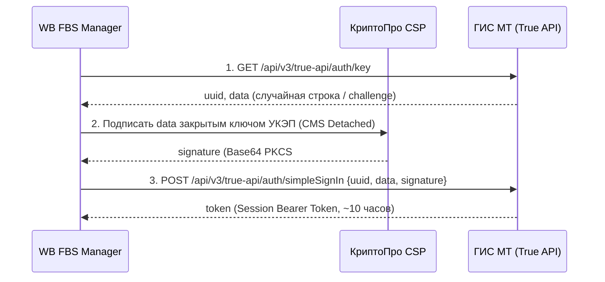

# Честный Знак: Аутентификация True API и Подпись УКЭП (КриптоПро)

> **Категория**: `chestny_znak_api` | **Документ ID**: `cz_01_auth_and_cryptography`  
> **Спецификация**: СУЗ-Облако 5.0 (API 3.0.38 Редакция 65) Секция 2.3.1 / True API ГИС МТ

---

## 1. Схема Двухэтапной Аутентификации (Challenge-Response)

Взаимодействие с ГИС МТ (True API) защищено ГОСТ-криптографией с усиленной квалифицированной электронной подписью (УКЭП).



### Шаг 1: Запрос Challenge
```http
GET /api/v3/true-api/auth/key HTTP/1.1
Host: markirovka.crpt.ru
Accept: application/json
```
**Ответ:**
```json
{
  "uuid": "4b68e4bf-98f2-49aa-b51c-76e9efc991e2",
  "data": "A1B2C3D4E5F6G7H8..."
}
```

### Шаг 2: Подписание строки закрытым ключом
Используется модуль [`app/services/crypto_service.py`](file:///D:/PyCharm_Projects/WB%20FBS/app/services/crypto_service.py) и утилита `csptest` / библиотека `pycades`:
- Алгоритм: ГОСТ Р 34.10-2012 (256 или 512 бит).
- Формат подписи: Открепленная CMS (PKCS#7 Detached), закодированная в Base64.

### Шаг 3: Получение токена сессии
```http
POST /api/v3/true-api/auth/simpleSignIn HTTP/1.1
Host: markirovka.crpt.ru
Content-Type: application/json

{
  "uuid": "4b68e4bf-98f2-49aa-b51c-76e9efc991e2",
  "data": "A1B2C3D4E5F6G7H8...",
  "signature": "MIAGCSqGSIb3DQEHAqCAMIACAQExDzANBglghkgBZQMEAgEF..."
}
```
**Ответ:**
```json
{
  "token": "eyJhbGciOiJHT1NUIi..."
}
```

---

## 2. Подписание HTTP-запросов СУЗ 3.0.38 (Секция 2.3.1)

Согласно регламенту СУЗ 3.0.38 (Секция 2.3.1 «Общие требования по подписанию запроса»):
Все запросы на изменение данных (`POST`, `PUT`), а также критические выборки (`GET`), должны быть подписаны открепленной подписью в HTTP-заголовке **`X-Signature`**.

### Правила каноникализации данных перед подписью:
1. **Для POST / PUT с телом JSON**:
   - Подписывается точная строка JSON без лишних пробелов, в кодировке `UTF-8` (`ensure_ascii=False`).
   - Полученная CMS-подпись помещается в заголовок `X-Signature: <base64_cms>`.
2. **Для GET-запросов**:
   - Подписывается конкатенация `REQUEST_PATH + QUERY_STRING` (например, `/api/v3/codes?omsId=...&orderId=...`).
   - Подпись передается в заголовке `X-Signature`.

---

## 3. Автоматическое Обновление Токенов (`cz_token_refresher`)

Агент [`app/agents/cz_token_refresher.py`](file:///D:/PyCharm_Projects/WB%20FBS/app/agents/cz_token_refresher.py) запускается каждые 30 минут:
- Проверяет срок действия сессионного токена каждого селлера.
- Если до истечения осталось менее 60 минут, выполняет автоматический re-auth через УКЭП.
- Сохраняет обновленный зашифрованный токен в БД.
