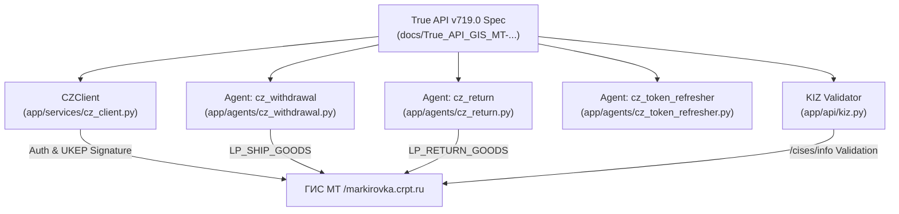

# Честный Знак: True API ГИС МТ v719.0 (Спецификация от 18.08.2026)

> **Категория**: `chestny_znak_api` | **Документ ID**: `cz_06_true_api_v719_reference`  
> **Первоисточник**: [`docs/True_API_GIS_MT-v719.0-18.08.2026-at-10-23-16.md`](file:///D:/PyCharm_Projects/WB%20FBS/docs/True_API_GIS_MT-v719.0-18.08.2026-at-10-23-16.md)  
> **Версия API**: True API v719.0 (18.08.2026) | **Оператор**: ООО «Оператор-ЦРПТ» (ГИС МТ)

---

## 1. О чем данный документ

Файл [`docs/True_API_GIS_MT-v719.0-18.08.2026-at-10-23-16.md`](file:///D:/PyCharm_Projects/WB%20FBS/docs/True_API_GIS_MT-v719.0-18.08.2026-at-10-23-16.md) представляет собой **официальную полную спецификацию True API ГИС МТ версии 719.0** (выпуск от 18 августа 2026 г.). Документ содержит исчерпывающее техническое руководство по программному взаимодействию информационных систем участников оборота товаров (УОТ) с государственной системой маркировки «Честный Знак».

### 📋 Ключевые разделы спецификации:
1. **Условия применения и криптографическая защита**:
   - Требования к УКЭП (ГОСТ Р 34.10-2012, CMS Detached / PKCS#7).
   - Лимиты запросов: до **50 RPS** на одного участника.
   - Стенды: Демонстрационный (`markirovka.sandbox.crptech.ru`) и Промышленный (`markirovka.crpt.ru`).
2. **Единая аутентификация (Challenge-Response)**:
   - Получение challenge: `GET /api/v3/true-api/auth/key`
   - Получение токена сессии: `POST /api/v3/true-api/auth/simpleSignIn`
3. **Единый метод создания документов (`POST /api/v3/true-api/doc/create`)**:
   - Ввод в оборот (`LP_INTRODUCE_GOODS`, контрактное производство, импорт ФТС, трансграничная торговля).
   - **Вывод из оборота (`LP_SHIP_GOODS`, `LK_RECEIPT`) — ключевой процесс для WB FBS (дистанционная торговля).**
   - **Возврат в оборот (`LP_RETURN_GOODS`) — ключевой процесс при возвратах покупателей с ПВЗ и отменах.**
   - Агрегация/трансформация упаковок (КИГУ, КИН, КИТУ, АТК).
   - Списание, перемаркировка, корректировка сведений.
4. **Методы получения сведений о КИ и маркированных товарах**:
   - Общедоступная информация по списку КИ: `POST /api/v3/true-api/cises/info`
   - Краткая информация: `POST /api/v3/true-api/cises/list` и `/cises/short/list`
   - Верификация подлинности КМ и история движения/агрегации.
   - Запросы карточек товаров и разрешительных документов в Национальном каталоге.
5. **Мониторинг документов, квитанций и ошибок**:
   - Статус обработки документа: `GET /api/v3/true-api/doc/{id}/info`
   - Получение квитанций: `GET /api/v3/true-api/documents/receipts/{id}`
   - Каталог возвращаемых ошибок и статусная модель.
6. **Выгрузки, ЭДО Лайт и СУЗ**:
   - Заказ асинхронных выгрузок по остаткам, движению КИ, ошибкам в чеках.
   - Прямая работа с универсальными передаточными документами (УПД/УКД) через ЭДО Лайт.
   - Получение токенов и взаимодействие со Станцией управления заказами (СУЗ).

---

## 2. Что нового в версии 719.0 (от 18.08.2026)

- **Новые статусы блокировок ОГВ в `/cises/info`**:  
  В параметре ответа `ogvs` (Органы государственной власти, установившие блокировку на КМ) добавлены значения:
  - `MZ` — Министерство здравоохранения РФ;
  - `VETRF` — ФГИС ВетИС («Меркурий»);
  - `RD` — Федеральная служба по аккредитации (Росаккредитация);
  - `FSSP` — Федеральная служба судебных приставов (ФССП).
- **Актуализация выгрузок данных**:  
  Обновлена доступность отчетов и выгрузок для товарных групп *«Косметика, бытовая химия и товары личной гигиены»* и *«Натуральный мех»*.

---

## 3. Чем документ полезен в проекте WB FBS Manager

Документ является **главным источником правды (Single Source of Truth)** для всех компонентов интеграции с Честным Знаком:

### Практическая польза по модулям системы:

1. **Валидация КИЗ перед передачей в Wildberries (`POST /api/v3/true-api/cises/info`)**:
   - Перед привязкой КИЗ к заказу WB (`PUT /api/v3/orders/{orderId}/meta/sgtin`) сервис запрашивает `/cises/info`.
   - Проверяет статус товара: должен быть `INTRODUCED` (в обороте).
   - Проверяет владельца: `ownerInn` должен совпадать с ИНН селлера в нашей БД.
   - Проверяет отсутствие блокировок ОГВ (`ogvs == null` или пустой массив).
2. **Автоматический вывод из оборота при FBS доставке (`LP_SHIP_GOODS`)**:
   - Celery-агент `cz_withdrawal` формирует документ выбытия при смене статуса заказа WB на `DELIVERED` или передаче в доставку.
   - Документ содержит цены в копейках, реквизиты первичного документа WB, ФИАС-код склада и УКЭП подпись.
3. **Автоматический возврат КИЗ в оборот при отменах (`LP_RETURN_GOODS`)**:
   - Celery-агент `cz_return` обрабатывает возвращенные товары и отмены сборочных заданий, возвращая КИЗ в статус `INTRODUCED` в течение установленного законом срока.
4. **Криптографическая безопасность и сессии (`crypto_service.py` & `cz_token_refresher`)**:
   - Точные контракты формирования открепленной подписи PKCS#7 Detached (ГОСТ Р 34.10-2012) для авторизации и подписи каждого документа `doc/create`.
   - Управление временем жизни Bearer-токена сессии (~10 часов).
5. **Диагностика ошибок и асинхронные квитанции**:
   - Точное сопоставление статусных кодов ГИС МТ (например, `409 Conflict`, `KIZ Not In Circulation`, `Invalid Signature`) в модуле `docs/troubleshooting/01_error_catalog_and_resolutions.md`.

---

## 4. Навигатор по Ключевым Разделам в Первоисточнике

Для экономии контекста агенты могут обращаться к точным строкам в файле [`docs/True_API_GIS_MT-v719.0-18.08.2026-at-10-23-16.md`](file:///D:/PyCharm_Projects/WB%20FBS/docs/True_API_GIS_MT-v719.0-18.08.2026-at-10-23-16.md):

| Раздел API | Описание и Метод | Номер раздела | Строка в файле |
|---|---|---|---|
| **Аутентификация** | `GET /auth/key`, `POST /auth/simpleSignIn` | Секция 1.5 | [L461](file:///D:/PyCharm_Projects/WB%20FBS/docs/True_API_GIS_MT-v719.0-18.08.2026-at-10-23-16.md#L461) |
| **Единый метод создания документов** | `POST /doc/create` (конверт, форматы, подпись) | Секция 4.1.1 | [L1482](file:///D:/PyCharm_Projects/WB%20FBS/docs/True_API_GIS_MT-v719.0-18.08.2026-at-10-23-16.md#L1482) |
| **Вывод из оборота (FBS)** | Документ `LK_RECEIPT` (`action: DISTANCE`), цены в копейках | Секция 4.1.8 | [L3537](file:///D:/PyCharm_Projects/WB%20FBS/docs/True_API_GIS_MT-v719.0-18.08.2026-at-10-23-16.md#L3537) |
| **Возврат в оборот** | Документ `LP_RETURN` (`products_list`, `ki`, `paid: true`) | Секция 4.1.5 | [L2819](file:///D:/PyCharm_Projects/WB%20FBS/docs/True_API_GIS_MT-v719.0-18.08.2026-at-10-23-16.md#L2819) |
| **Информация о КИ** | `POST /cises/info` (статусы, блокировки ОГВ) | Секция 5.1.2 | [L5385](file:///D:/PyCharm_Projects/WB%20FBS/docs/True_API_GIS_MT-v719.0-18.08.2026-at-10-23-16.md#L5385) |
| **Статус документа** | `GET /doc/{id}/info` | Секция 6.7 | [L8334](file:///D:/PyCharm_Projects/WB%20FBS/docs/True_API_GIS_MT-v719.0-18.08.2026-at-10-23-16.md#L8334) |
| **Квитанции обработки** | `GET /documents/receipts/{id}` | Секция 7.1 | [L8445](file:///D:/PyCharm_Projects/WB%20FBS/docs/True_API_GIS_MT-v719.0-18.08.2026-at-10-23-16.md#L8445) |
| **Коды ошибок ЭДО/чеков** | Справочник кодов ошибок обработки | Секция 7.3 | [L8607](file:///D:/PyCharm_Projects/WB%20FBS/docs/True_API_GIS_MT-v719.0-18.08.2026-at-10-23-16.md#L8607) |
| **Справочники системы** | Товарные группы, статусы, причины выбытия | Приложение 1 | [L14300](file:///D:/PyCharm_Projects/WB%20FBS/docs/True_API_GIS_MT-v719.0-18.08.2026-at-10-23-16.md#L14300) |
